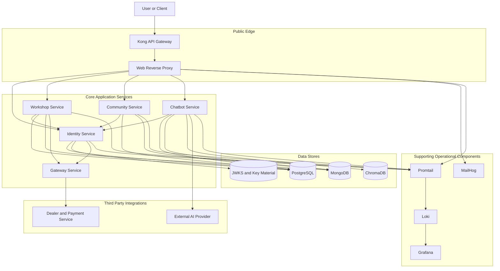
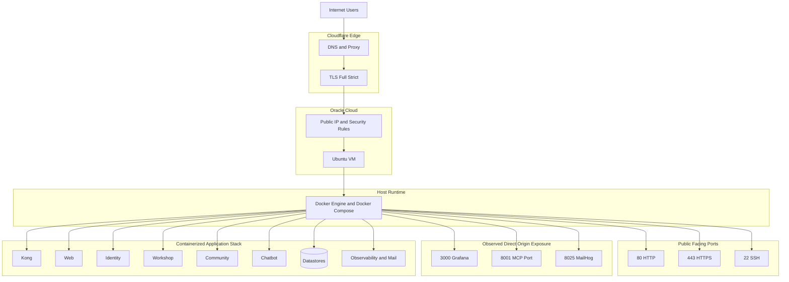
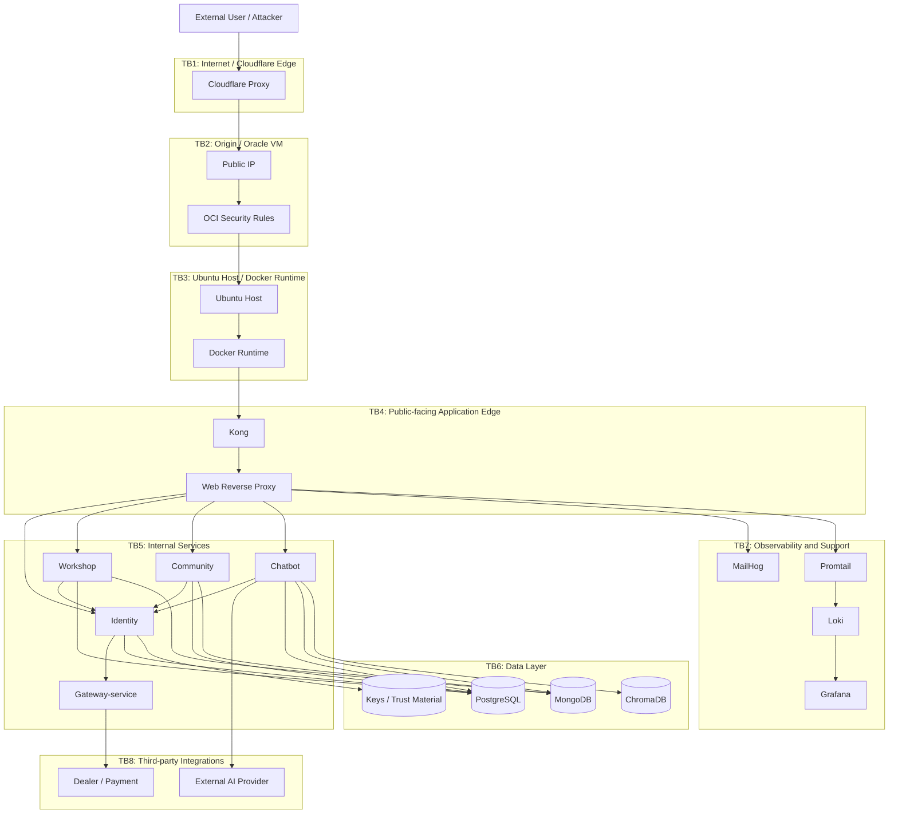
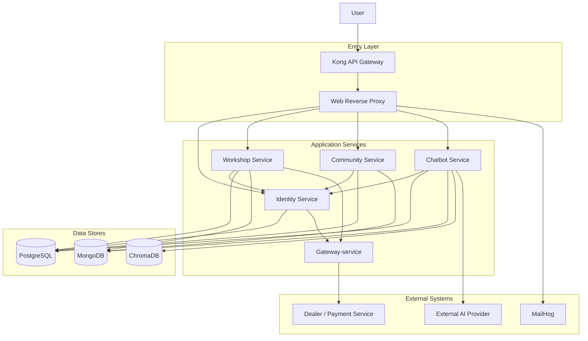

# Threat Model for the Deployed crAPI-based System

## 1. Document purpose

This document presents the threat model for the modified OWASP crAPI system deployed in the real environment used for the project. The analysis is structured to clearly separate:

- **solution architecture**
- **deployment scenario**
- **security objectives**
- **threat analysis by layer**
- **observed deployment state** versus **target hardened state**

The document follows the general approach recommended by the **OWASP Threat Modeling Cheat Sheet** and applies **STRIDE** to the deployed system.

---

## 2. System context and Target of Evaluation

### 2.1 Background

The project is based on **OWASP crAPI** and extended through the team's modifications and deployment decisions. The goal is not to redesign the entire system from scratch, but to deploy, adapt, and evaluate a realistic API-centric system in a cloud environment.

### 2.2 Target of Evaluation (TOE)

The **Target of Evaluation (TOE)** is the modified OWASP crAPI deployment, including:

- **Cloudflare edge**
- **Oracle Cloud Ubuntu virtual machine**
- **Docker Compose runtime**
- core application services:
  - Kong API Gateway
  - Web reverse proxy
  - Identity service
  - Workshop service
  - Community service
  - Chatbot service
  - Gateway-service
- data stores:
  - PostgreSQL
  - MongoDB
  - ChromaDB
- supporting operational components:
  - Grafana
  - Loki
  - Promtail
  - MailHog

The **MCP server is not considered part of the active deployment scope**, although it exists in the codebase and may appear in configuration.

### 2.3 In-scope elements

- deployed application architecture
- deployment topology and public exposure
- trust boundaries
- inter-service data flows
- operational surfaces relevant to security
- threat analysis using STRIDE
- mitigation direction for the target hardened deployment

### 2.4 Out-of-scope elements

- internal implementation of Cloudflare and Oracle Cloud
- end-user devices
- development process outside the deployed system
- inactive code paths that are not part of the deployed attack surface unless they materially affect exposure

---

## 3. Security objectives

The deployed system is evaluated against the following security objectives:

1. Only legitimate users should access resources that belong to them.
2. Only necessary services and ports should be publicly exposed.
3. Internal service-to-service communication should be protected and authenticated appropriately.
4. Sensitive data should not be exposed through debug interfaces, logs, MailHog, Grafana, or auxiliary services.
5. A compromise of one component should not trivially lead to compromise of the entire host or the full system.
6. Important security-relevant actions should be auditable.
7. The system should maintain basic availability under common abuse scenarios.

### 3.1 Security priority

The security priorities for this project are ordered as follows:

**Integrity > Confidentiality > Availability > Accountability**

This prioritization is appropriate because the system contains multiple authentication, authorization, and business-data flows. If integrity fails in those flows, the damage can propagate across the whole system.

---

## 4. Solution architecture

This section describes the **logical solution architecture** of the deployed system, independent of the deployment environment.

### 4.1 Core application services

- **Kong API Gateway**: entry routing and edge traffic control
- **Web reverse proxy**: path-based routing to backend services
- **Identity service**: authentication and trust anchor
- **Workshop service**: order, workshop, and service request logic
- **Community service**: posts, comments, and coupon logic
- **Chatbot service**: chatbot-related logic and AI-connected flows
- **Gateway-service**: external gateway/dealer/payment-facing integration

### 4.2 Data stores

- **PostgreSQL**: relational application data such as users, vehicles, orders, and service requests
- **MongoDB**: posts, coupons, sessions, and other document-style data
- **ChromaDB**: vector and retrieval-related chatbot data
- **JWKS / key material**: trust-related keys and certificates

### 4.3 Supporting operational components

- **MailHog**: mail capture and mail UI
- **Promtail**: log collection agent
- **Loki**: centralized log storage
- **Grafana**: log visualization and operational visibility

### 4.4 Application-level trust boundaries

- Public edge boundary
- Internal service boundary
- Data layer boundary
- Observability boundary
- Third-party integration boundary

### 4.5 Solution architecture diagram

---

## 5. Deployment scenario

This section describes the **real deployment scenario**, separate from the logical solution architecture.

### 5.1 Actual deployment path

The deployed request path is:

**Internet -> Cloudflare (DNS + proxy, SSL Full strict) -> Oracle public IP -> Ubuntu VM -> Docker Compose services**

### 5.2 Host platform

- one Oracle Cloud Ubuntu VM
- one Docker Engine / Docker Compose runtime
- all containers deployed on the same host

This creates a **single-host failure domain**. A host compromise or host outage may affect the entire application stack.

### 5.3 Observed current public exposure

Based on the observed OCI ingress rules, the currently public ports are:

- `22`
- `80`
- `443`
- `3000`
- `8001`
- `8025`

This means that, in addition to the Cloudflare-proxied web entry, the origin host also exposes direct-access surfaces such as:

- SSH
- Grafana
- MCP-related port
- MailHog

### 5.4 Target hardened deployment state

The target deployment state should minimize direct-origin exposure.

#### Public ports

- `80`
- `443`
- `22` only if remote administration is required, preferably restricted by source IP or equivalent controls

#### Internal or admin-only ports

- `3000` for Grafana
- `8001` for MCP
- `8025` for MailHog
- any other admin, debug, or operations ports

### 5.5 Deployment scenario diagram

---

## 6. Assets to protect

### 6.1 Business and user data

- user account data
- email and profile data
- vehicle data
- order and service request data
- community content
- chatbot session and history data

### 6.2 Security-sensitive assets

- JWT/JWKS key material
- TLS certificates and keys
- database credentials
- external provider credentials
- gateway or vendor credentials

### 6.3 Operational assets

- logs
- Grafana access and dashboards
- MailHog contents
- Docker runtime and configuration
- host volumes and mounted files
- VM snapshot or backup data

---

## 7. Threat actors

| Threat actor | Description |
|---|---|
| External unauthenticated attacker | Attempts access from the Internet via Cloudflare or direct-origin ports |
| Authenticated low-privilege user | Attempts business-logic abuse or unauthorized data access |
| Malicious insider or operator | Has legitimate infrastructure or host access and may misuse it |
| Compromised container | One service is compromised and used to pivot to others or the host |
| Third-party dependency risk | External providers or operational surfaces contribute to exposure |

---

## 8. Trust boundaries for the deployed system

### TB1 — Internet / Cloudflare edge
Boundary between the public Internet and the Cloudflare-proxied public edge.

### TB2 — Origin / Oracle VM
Boundary between public traffic and the origin server.

### TB3 — Ubuntu host / Docker runtime
Boundary between the host operating system and containerized services.

### TB4 — Public-facing application edge
Boundary at Kong and the web reverse proxy.

### TB5 — Internal services
Boundary between internal application services.

### TB6 — Data layer
Boundary between services and data stores / trust material.

### TB7 — Observability and support services
Boundary for Grafana, Loki, Promtail, and MailHog.

### TB8 — Third-party integrations
Boundary for external dealer/payment services and external AI/provider services.

### 8.1 Trust boundary diagram

---

## 9. STRIDE analysis by layer

This section applies STRIDE at the level of the deployed system.

---

## 9.1 Network and edge layer

### Relevant assets

- Cloudflare-facing web entry
- origin public IP
- public ports
- request-routing surfaces

### Spoofing

- impersonation of legitimate client behavior
- direct-origin access that bypasses assumptions about Cloudflare mediation

### Tampering

- modification of requests or headers before internal processing
- abuse of proxy and request-rewrite behavior

### Repudiation

- weak correlation between edge logs and backend logs
- difficulty proving the full path of a malicious request

### Information Disclosure

- disclosure through direct-origin exposure of non-user services
- route and interface enumeration
- exposure of metadata through debug or auxiliary services

### Denial of Service

- flooding web entry points
- abuse of public services on the origin host

### Elevation of Privilege

- bypass of edge assumptions by reaching origin-exposed ports directly
- misuse of a route that was intended only for operations or support

### Key finding

The deployment is not only a web application behind Cloudflare. It also includes **direct-origin exposure**, which materially changes the network-layer threat model.

---

## 9.2 Host and runtime layer

### Relevant assets

- Ubuntu VM
- Docker Engine
- Docker Compose configuration
- mounted volumes and secrets

### Spoofing

- impersonation of an operator or internal service

### Tampering

- modification of Compose files, mounted config, env values, or certificates
- unauthorized changes to running containers or images

### Repudiation

- lack of strong auditability for SSH, sudo, or Docker-level actions

### Information Disclosure

- exposure of secrets from host storage, logs, or backup material
- access to support services that reveal system internals

### Denial of Service

- resource exhaustion on the single VM
- host failure, disk exhaustion, or Docker daemon instability

### Elevation of Privilege

- compromise of one container leading to lateral movement or host control
- abuse of runtime access to gain broad system control

### Key finding

Because the full stack runs on a single VM, host-level compromise or failure has a high blast radius.

---

## 9.3 Application and data-flow layer

### 9.3.1 Kong and web reverse proxy

Key threats include:

- tampering through routing or proxy behavior
- policy mismatch between edge routing and downstream authorization assumptions
- information disclosure through debug or exposed support paths
- denial of service at the public entry point

### 9.3.2 Identity service

Identity is the trust anchor for the application.

Key threats include:

- spoofing of user or service identity
- tampering with token-related trust decisions
- information disclosure of user and trust data
- elevation of privilege through weak or inconsistent auth handling

### 9.3.3 Workshop service

Key threats include:

- manipulation of business objects such as orders or service requests
- broken ownership enforcement
- misuse of downstream trust assumptions

### 9.3.4 Community service

Key threats include:

- unauthorized modification of posts, comments, or coupon data
- disclosure of user or content data
- misuse of request parameters or trust assumptions

### 9.3.5 Chatbot service

Key threats include:

- exposure of session or history data
- prompt-driven overreach into application or data layers
- disclosure to third-party providers
- abuse of expensive or sensitive functionality

### Key finding

Integrity of identity, authorization, and business-data flows is central to the system’s security posture.

### 9.3.6 Application data-flow diagram

---

## 9.4 Data layer

### PostgreSQL

Threats include:

- unauthorized reads and writes
- integrity loss of user, vehicle, and order data
- broad service access or over-privileged database roles

### MongoDB

Threats include:

- session or document disclosure
- tampering with posts, coupons, or other document data
- excessive service access to shared data

### ChromaDB

Threats include:

- semantic-memory leakage
- poisoning or tampering with retrieval context
- indirect disclosure through AI-related retrieval paths

### Keys and certificates

Threats include:

- key theft
- tampering with trust material
- forged trust relationships or invalid trust assumptions

---

## 9.5 Observability and supporting services

### Grafana, Loki, and Promtail

Threats include:

- disclosure of sensitive information through logs
- exposure of operational metadata
- log flooding or log injection
- insufficient visibility due to lack of rules or alerts

### MailHog

Threats include:

- exposure of email contents
- disclosure of reset or verification workflows
- accidental treatment of a support interface as a public interface

### Key finding

Support and observability components are not core business functions, but when exposed they significantly increase the attack surface and disclosure risk.

---

## 10. Key threat scenarios

### T1 — Direct-origin public exposure beyond 80/443

**Scenario:** Ports such as `3000`, `8001`, and `8025` are publicly reachable on the origin host.

**Impact:** Administrative or support surfaces are exposed directly to the Internet.

**Risk level:** High

### T2 — Public Grafana exposure

**Scenario:** Grafana is reachable publicly on `3000`.

**Impact:** Internal logs, system metadata, or operational information may be exposed.

**Risk level:** High

### T3 — Public MailHog exposure

**Scenario:** MailHog is reachable publicly on `8025`.

**Impact:** Email flows, reset links, or internal data may be disclosed.

**Risk level:** High

### T4 — Identity trust compromise

**Scenario:** Weakness or inconsistency in identity-related trust decisions affects downstream services.

**Impact:** Compromise of access control across the system.

**Risk level:** Critical

### T5 — Host compromise and lateral movement

**Scenario:** One service or support surface is compromised and used to pivot across the host.

**Impact:** High-impact compromise of the whole deployed stack.

**Risk level:** Critical

### T6 — Sensitive information exposure through logs and support interfaces

**Scenario:** Logs, dashboards, or support interfaces reveal internal or sensitive data.

**Impact:** Confidentiality loss and increased attacker knowledge.

**Risk level:** High

### T7 — Single-host availability failure

**Scenario:** The VM, Docker runtime, or host resources fail.

**Impact:** Whole-system availability loss.

**Risk level:** High

### T8 — Gap between observed state and target hardened state

**Scenario:** Public exposure remains broader than intended because hardening is incomplete.

**Impact:** Security objectives are not fully met in practice.

**Risk level:** High

---

## 11. Risk response and mitigation direction

### 11.1 Network and deployment controls

- keep only necessary ports public
- move Grafana, MailHog, and similar surfaces to internal or admin-only access
- reduce direct-origin exposure
- restrict SSH exposure as much as possible

### 11.2 Host and runtime controls

- restrict privileged access to the VM and Docker runtime
- protect volumes, certificates, and runtime configuration
- monitor resource exhaustion and host-level failure conditions

### 11.3 Application controls

- maintain strict identity and authorization handling
- minimize exposure of debug or support interfaces
- enforce ownership and server-side authorization checks in business services

### 11.4 Data and observability controls

- reduce sensitive information in logs
- protect access to dashboards and mail capture interfaces
- review retention and visibility of operational data

---

## 12. Observed state versus target secure state

### 12.1 Observed current state

- Cloudflare proxy with Full strict TLS is configured
- the Oracle VM remains the origin host
- OCI ingress rules currently expose more than the minimum user-facing services
- support interfaces such as Grafana and MailHog are part of the practical attack surface

### 12.2 Target secure state

- only intended user-facing entry points remain public
- support and administrative services are moved behind internal-only or restricted access
- deployment exposure matches the security objective of minimum public attack surface

This distinction is important because a threat model should reflect both:

- the **observed deployment reality**
- the **intended hardened deployment state**

---

## 13. Conclusion

The final threat model must be understood as a combination of two connected but distinct views:

1. **Solution architecture threat model**
   - services
   - data stores
   - trust relationships
   - data flows

2. **Deployment threat model**
   - Cloudflare
   - Oracle public IP
   - Ubuntu VM
   - Docker Compose runtime
   - exposed ports
   - support and observability services

The most important conclusion is that the deployed system should not be treated as only a web application behind Cloudflare. It is a cloud-hosted, containerized system with additional origin-exposed and operational interfaces. Therefore, minimum public exposure, host/runtime protection, and clear separation between business-facing services and support services are essential to meeting the project’s security objectives.

---

## 14. Placeholder section for final diagrams

### Figure A — Solution Architecture Diagram

> **[Insert final version here]**

### Figure B — Deployment Scenario Diagram

> **[Insert final version here]**

### Figure C — Trust Boundary Diagram

> **[Insert final version here]**

### Figure D — Application Data Flow Diagram

> **[Insert final version here]**
